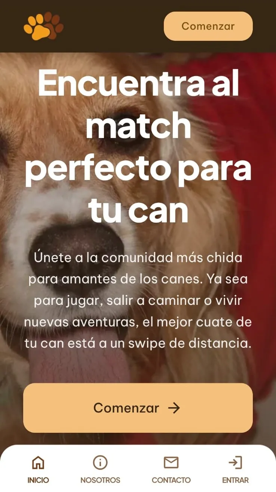
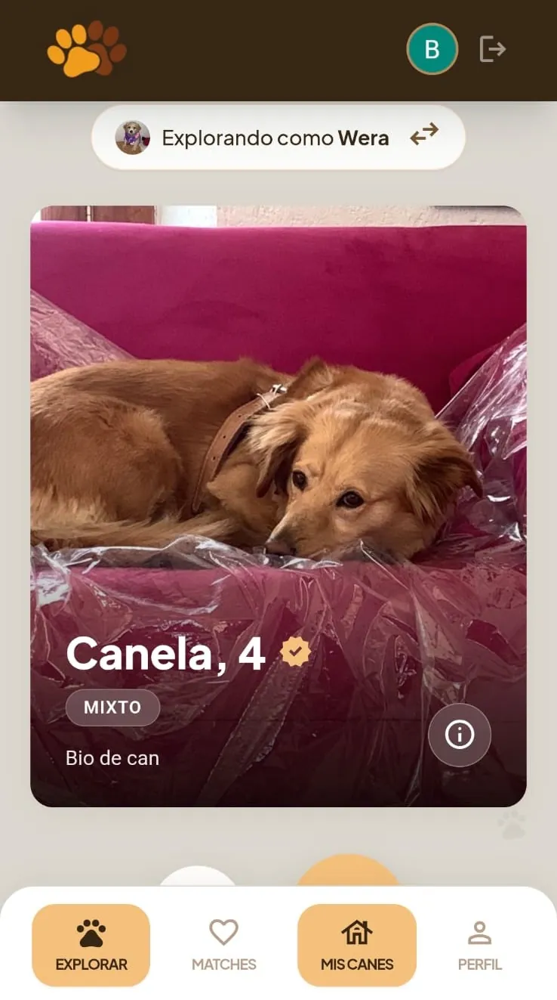
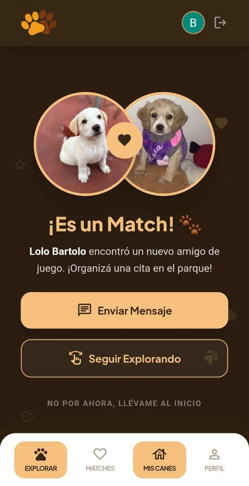
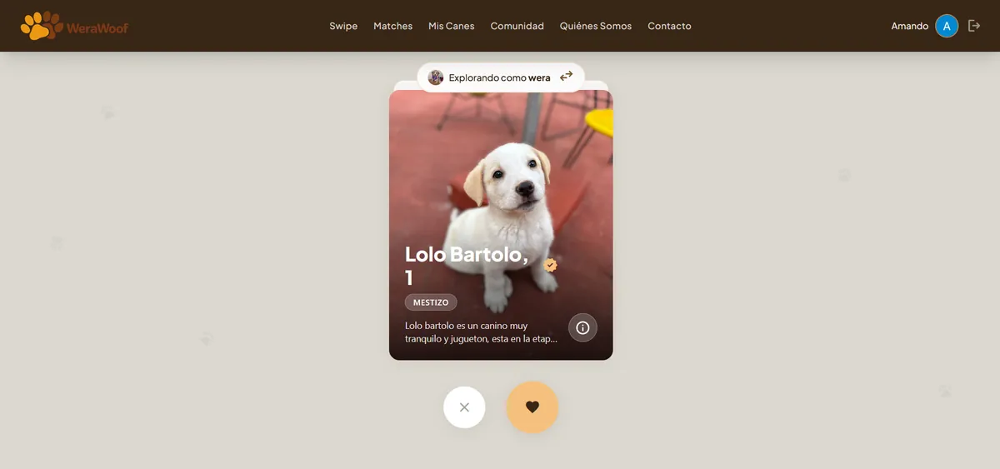
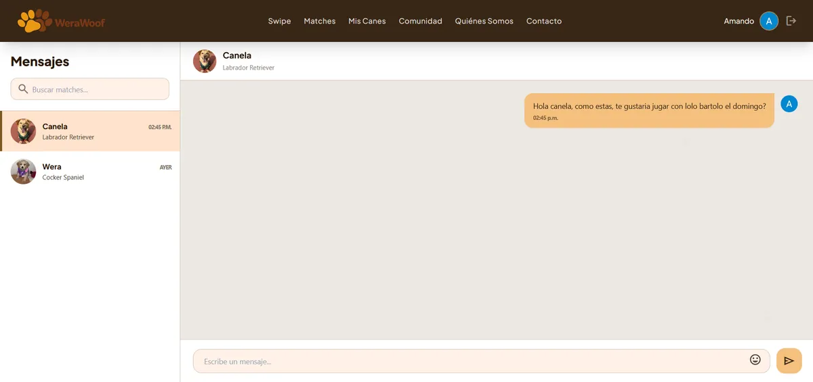

<div align="center">

# 🐾 WeraWoof

### _Conectá patitas, creá recuerdos._

Una plataforma de matches para dueños de perros: swipe, match y chat en tiempo real.

[](https://nuxt.com)
[](https://vuejs.org)
[](https://www.typescriptlang.org)
[](https://supabase.com)
[](https://tailwindcss.com)
[](https://werawoof.com)
[](https://github.com/kenshivr/werawoof/actions/workflows/ci.yml)
[](https://pagespeed.web.dev/analysis?url=https%3A%2F%2Fwerawoof.com)
[](https://werawoof.com)


[Ver la app](https://werawoof.com) · [Reportar un bug](https://github.com/kenshivr/werawoof/issues) · [Pedir una funcionalidad](https://github.com/kenshivr/werawoof/issues)

🌐 [Read this in English](README.en.md)

</div>

---

## Tabla de contenido

- [Descripción](#descripción)
- [Capturas](#capturas)
- [Funcionalidades](#funcionalidades)
- [Stack](#stack)
- [Arquitectura](#arquitectura)
- [Primeros pasos](#primeros-pasos)
  - [Requisitos](#requisitos)
  - [Instalación](#instalación)
  - [Configurar Supabase](#configurar-supabase)
  - [Variables de entorno](#variables-de-entorno)
  - [Correr en desarrollo](#correr-en-desarrollo)
- [Scripts](#scripts)
- [Estructura del proyecto](#estructura-del-proyecto)
- [Modelo de datos](#modelo-de-datos)
- [Server routes](#server-routes)
- [Modelo de seguridad](#modelo-de-seguridad)
- [Despliegue](#despliegue)
- [Contribuir](#contribuir)
- [Licencia](#licencia)

---

## Descripción

**WeraWoof** es una aplicación web inspirada en Tinder, pero para perros. Los dueños crean perfiles para sus mascotas, hacen swipe sobre otros perros, obtienen un match cuando a ambos lados les gustó y chatean en tiempo real con el otro dueño para organizar una cita de juego.

El nombre viene de _Wera_, una perra real que inspiró el proyecto.

WeraWoof nació con un backend en Go + Gin (PostgreSQL, Redis, WebSockets) alojado en Railway. En septiembre de 2026 ese backend se reemplazó por completo por **Supabase** (Postgres con Row Level Security, Auth, Realtime y Storage) y la app ahora es un solo proyecto Nuxt 3 en Vercel. La implementación en Go sigue en la historia de git hasta el commit `4033595`.

---

## Capturas

<p align="center">
  
  
  
</p>

<p align="center">
  
  
</p>

[PageSpeed Insights](https://pagespeed.web.dev/analysis?url=https%3A%2F%2Fwerawoof.com) sobre la landing de producción (móvil medido el 2026-09-16 con la landing prerenderizada, escritorio el 2026-09-11):

| Dispositivo | Rendimiento | Accesibilidad | Recomendaciones | SEO | FCP   | LCP   |
| ----------- | ----------- | ------------- | --------------- | --- | ----- | ----- |
| Móvil       | 100         | 100           | 100             | 100 | 0.9 s | 1.7 s |
| Escritorio  | 100         | 100           | 100             | 100 | 0.4 s | 0.7 s |

---

## Funcionalidades

### 🐕 Perfiles de perros

- Varios perros por cuenta
- Raza, edad, sexo, tamaño, bio y etiquetas de personalidad
- Varias fotos por perro en Supabase Storage, con orden por arrastrar y soltar

### 💘 Swipe y match

- Me gusta o no me gusta a otros perros
- El feed de candidatos excluye tus perros y los que ya swipeaste (RPC en Postgres)
- Candidatos por cercanía: el dueño comparte su ubicación (Geolocation API del navegador), ve su dirección aproximada para confirmarla (reverse geocoding con OpenStreetMap) y elige un radio de 1 a 100 km; PostGIS filtra y calcula la distancia en Postgres
- Un like mutuo crea el match automáticamente con un trigger de la base
- Pantalla de celebración del match y lista de matches por cuenta

### 💬 Chat en tiempo real

- Una conversación por match
- Historial cargado desde Postgres; los mensajes nuevos llegan por Supabase Realtime
- Selector de emojis

### 🌎 Comunidad

- Página pública `/comunidad` con reseñas de los miembros (una por usuario, editable)
- Landing, quiénes somos, formulario de contacto, newsletter y páginas legales, todas públicas

### 🔐 Autenticación

- Registro con correo y contraseña, con correo de confirmación
- Google OAuth
- Restablecer contraseña por correo
- Borrado de cuenta (en cascada: perfil, perros, swipes, matches y mensajes)
- El perfil se crea automáticamente al registrarse con un trigger de la base
- Al iniciar sesión, quien todavía no tiene canes cae en el perfil para completar el alta; quien ya los tiene va a Mis Canes

### 📱 App instalable (PWA)

- Se instala desde Chrome (Android y escritorio) y abre a pantalla completa, sin barra del navegador, directo en Mis Canes (`display: standalone`, `start_url: /app/dogs`)
- El `scope` es `/`: todas las páginas del dominio, públicas y privadas, se abren dentro de la app. Un destino fuera del scope (por ejemplo la pantalla de consentimiento de Google) se abre en una pestaña con barra que Chrome cierra al volver
- Manifest estático en `frontend/public/manifest.webmanifest`, sin service worker (no hay modo offline). Chrome revisa el manifest de la app instalada al abrirla, como mucho una vez cada 24 horas, y actualiza la app si cambiaron `scope`, `start_url`, íconos o colores; para forzarlo, desinstalar y volver a instalar

### 📊 Panel de administración

- Solo para usuarios con el rol `admin`; se entra desde la tarjeta "Panel de admin" del perfil (la PWA instalada no tiene barra de direcciones)
- Usuarios, perros, matches, suscriptores y visitas, agregados por una sola función de Postgres
- Registro de visitas desde una server route (ruta, IP y user agent)

---

## Stack

| Capa            | Tecnología                                                                            |
| --------------- | ------------------------------------------------------------------------------------- |
| **Framework**   | Nuxt 3 (Vue 3, SSR; landing y quiénes somos prerenderizadas) sobre Nitro              |
| **Lenguaje**    | TypeScript (strict)                                                                   |
| **Estado**      | Pinia                                                                                 |
| **Estilos**     | Tailwind CSS, fuentes self-hosted                                                     |
| **Backend**     | Supabase: Postgres, Auth, Realtime, Storage                                           |
| **SDK cliente** | `@nuxtjs/supabase` (supabase-js, cookies SSR)                                         |
| **Servidor**    | Server routes de Nitro para contacto, newsletter, visitas y borrado de cuenta         |
| **Correo**      | SMTP de Gmail con nodemailer (cuenta dedicada)                                        |
| **Analítica**   | Vercel Analytics                                                                      |
| **Calidad**     | ESLint, Prettier, Vitest, husky + lint-staged · Lighthouse 100 móvil / 100 escritorio |
| **CI/CD**       | GitHub Actions (lint + typecheck + tests), Vercel (deploy)                            |
| **Hosting**     | Vercel                                                                                |

---

## Arquitectura

```
┌───────────────────────────────────────────────────────────────┐
│                     APP NUXT 3 (Vercel)                       │
│                                                               │
│   Páginas · Componentes · Stores de Pinia · Middlewares       │
│                                                               │
│   ┌──────────────────────────┐   ┌──────────────────────────┐ │
│   │  supabase-js (browser)   │   │  Server routes de Nitro  │ │
│   │  Auth · tablas vía RLS   │   │  /api/contact            │ │
│   │  RPC · Realtime          │   │  /api/newsletter         │ │
│   │  Storage                 │   │  /api/track              │ │
│   │                          │   │  /api/account (DELETE)   │ │
│   └────────────┬─────────────┘   └───────┬──────────┬───────┘ │
└────────────────┼─────────────────────────┼──────────┼─────────┘
                 │ anon key + JWT usuario  │ secret   │ SMTP
                 ▼                         ▼ key      ▼
┌──────────────────────────────────────────────┐  ┌────────────┐
│                  SUPABASE                    │  │   GMAIL    │
│  Postgres (RLS, triggers, RPC) · Auth        │  │  (SMTP)    │
│  Realtime (messages, matches) · Storage      │  │            │
└──────────────────────────────────────────────┘  └────────────┘
```

- **Sin backend propio.** El navegador habla directo con Supabase con el JWT del usuario; cada tabla está protegida por Row Level Security, así que las políticas _son_ la capa de autorización.
- **Las reglas de negocio viven en Postgres.** Crear el perfil, detectar el match y elegir candidatos son triggers y funciones, no código de la app.
- **Server routes solo donde hace falta un secreto.** La service-role key y las credenciales SMTP nunca llegan al navegador.

El porqué de estas decisiones está en los [registros de decisiones de arquitectura](docs/adr/README.md). También hay un [postmortem del día del cutover](docs/postmortem-2026-09-06-cutover.md).

---

## Primeros pasos

### Requisitos

- [Node.js 22](https://nodejs.org/) y npm (la versión que corre en CI)
- Un proyecto de [Supabase](https://supabase.com) (el plan gratuito alcanza)
- Opcional: una cuenta de Gmail con [contraseña de aplicación](https://myaccount.google.com/apppasswords) para el formulario de contacto y el newsletter

### Instalación

```bash
git clone https://github.com/kenshivr/werawoof.git
cd werawoof/frontend
npm install
```

`npm install` también instala los hooks de git desde la raíz del repositorio (husky).

### Configurar Supabase

1. Crea un proyecto en el dashboard de Supabase.
2. Abre el **SQL Editor** y corre, en este orden y una sola vez cada uno:
   - `supabase/schema.sql`: tablas, políticas RLS, triggers, RPC, Realtime y el bucket `photos`
   - `supabase/002_get_reviews.sql`: función de reseñas públicas para `/comunidad`
   - `supabase/003_admin_dashboard.sql`: función del panel de administración
   - `supabase/004_drop_anon_policies.sql`: retira las políticas de insert anónimo (las server routes escriben con la secret key)
   - `supabase/005_ubicacion.sql`: PostGIS, ubicación del dueño, radio de búsqueda y `get_candidates` por cercanía
   - `supabase/006_ubicacion_etiqueta.sql`: etiqueta legible de la ubicación ("colonia, municipio, estado")
3. **Authentication → URL Configuration**: pon tu URL de producción como Site URL y agrega `http://localhost:3003/**` y `https://<tu-dominio>/**` a las Redirect URLs.
4. **Authentication → Providers → Google** (opcional): crea un cliente OAuth en Google Cloud Console con `https://<project-ref>.supabase.co/auth/v1/callback` como redirect URI y pega el client ID y el secret.
5. **Authentication → SMTP Settings** (recomendado): configura un SMTP propio. El remitente integrado de Supabase entrega unos pocos correos por hora y solo a miembros del proyecto, lo que bloquea los registros reales.
6. Promueve tu admin cuando tu usuario exista:

   ```sql
   update public.profiles set role = 'admin' where id = '<tu-uuid>';
   ```

7. Genera los tipos de TypeScript del esquema y guárdalos como `frontend/types/database.types.ts` (dashboard de Supabase → API Docs → _Generate and download types_, o `supabase gen types typescript --project-id <project-ref> --schema public`). Regéneralos cada vez que cambie el esquema.

### Variables de entorno

Crea `frontend/.env`:

| Variable                   | Alcance     | Descripción                                                                         |
| -------------------------- | ----------- | ----------------------------------------------------------------------------------- |
| `NUXT_PUBLIC_SUPABASE_URL` | pública     | URL del proyecto, `https://<project-ref>.supabase.co`                               |
| `NUXT_PUBLIC_SUPABASE_KEY` | pública     | Anon / publishable key                                                              |
| `NUXT_SUPABASE_SECRET_KEY` | solo server | Service-role / secret key. La usan `/api/account`, `/api/newsletter` y `/api/track` |
| `NUXT_SMTP_USER`           | solo server | Cuenta de Gmail que envía los correos de contacto y newsletter                      |
| `NUXT_SMTP_PASS`           | solo server | Contraseña de aplicación de esa cuenta                                              |

> `@nuxtjs/supabase` también acepta `SUPABASE_URL` y `SUPABASE_KEY` en local. `SUPABASE_SERVICE_KEY` está deprecada por el módulo; usa `NUXT_SUPABASE_SECRET_KEY`.

La bandeja que recibe los mensajes de contacto y los avisos del newsletter es la constante `CONTACT_INBOX` en `frontend/server/utils/mail.ts`. Cámbiala si haces tu propio despliegue.

### Correr en desarrollo

```bash
cd frontend
npm run dev
```

| Servicio      | URL                       |
| ------------- | ------------------------- |
| App           | http://localhost:3003     |
| Dashboard     | http://localhost:3003/app |
| Nuxt DevTools | activado en dev           |

Regístrate con un correo real: el enlace de confirmación pasa por Supabase Auth. El login con Google solo funciona cuando el provider está habilitado en el dashboard.

---

## Scripts

Todos se corren desde `frontend/`:

| Script              | Qué hace                                 |
| ------------------- | ---------------------------------------- |
| `npm run dev`       | Servidor de desarrollo en el puerto 3003 |
| `npm run build`     | Build de producción (`.output/`)         |
| `npm run preview`   | Sirve el build de producción en local    |
| `npm run generate`  | Generación estática                      |
| `npm run lint`      | ESLint                                   |
| `npm run lint:fix`  | ESLint con autofix                       |
| `npm run typecheck` | `vue-tsc` a través de `nuxi typecheck`   |
| `npm run test`      | Tests unitarios con Vitest (`tests/`)    |

En cada commit, husky corre lint-staged: ESLint + Prettier sobre los `.ts` y `.vue` en stage, Prettier sobre `.css`, `.md` y `.json`.

---

## Estructura del proyecto

```
werawoof/
├── .github/workflows/ci.yml           # Lint + typecheck + tests en push / PR a main
├── .husky/pre-commit                  # lint-staged
├── CHANGELOG.md · LICENSE
├── docs/
│   ├── adr/                           # Registros de decisiones de arquitectura
│   ├── screenshots/                   # Imágenes del README
│   ├── postmortem-2026-09-06-cutover.md
│   └── social-preview.html · .png     # Social preview de GitHub (renderizada con Edge headless)
├── supabase/
│   ├── schema.sql                     # Tablas, RLS, triggers, RPC, Realtime, Storage
│   ├── 002_get_reviews.sql            # Reseñas públicas (security definer)
│   ├── 003_admin_dashboard.sql        # Agregación del panel de administración
│   ├── 004_drop_anon_policies.sql     # Las server routes escriben con la secret key
│   ├── 005_ubicacion.sql              # PostGIS: ubicación del dueño y candidatos por radio
│   └── 006_ubicacion_etiqueta.sql     # Etiqueta legible de la ubicación
│
└── frontend/
    ├── nuxt.config.ts                 # Módulos, head de SEO, puerto 3003, runtimeConfig
    ├── vitest.config.ts               # Tests unitarios sin Nuxt: auto-imports de Nitro como stubs
    ├── app.vue · error.vue
    ├── pages/
    │   ├── index.vue                  # Landing
    │   ├── comunidad.vue              # Reseñas públicas
    │   ├── quienes-somos.vue          # Quiénes somos
    │   ├── contacto.vue               # Formulario de contacto
    │   ├── politica-de-privacidad.vue · terminos-de-servicio.vue
    │   ├── [...slug].vue              # 404
    │   ├── auth/                      # login · register · check-email · callback
    │   │                              # forgot-password · reset-password
    │   └── app/                       # Zona protegida (/app redirige a /app/dogs)
    │       ├── dogs/                  # index · new · [id]/edit
    │       ├── swipe/[dogId].vue      # Swipe con uno de tus perros
    │       ├── matches.vue
    │       ├── chat/[id].vue          # Chat por match
    │       ├── profile.vue
    │       └── admin.vue              # Panel de administración
    ├── components/
    │   ├── auth/AuthCard.vue          # Tarjeta de login / registro (correo + Google)
    │   ├── layout/                    # Headers público y simple, footers, barra inferior
    │   ├── MatchCelebration.vue
    │   └── EmojiPicker.client.vue
    ├── layouts/                       # app · public · onboarding · default
    ├── middleware/                     # auth · guest · admin (guards de ruta)
    ├── plugins/
    │   ├── auth.client.ts             # Sincroniza el perfil con la sesión de Supabase
    │   └── track.client.ts            # Manda las visitas a /api/track
    ├── stores/                        # Pinia: auth · dogs · messages · reviews
    ├── server/
    │   ├── api/                       # contact · newsletter · track · account.delete
    │   └── utils/mail.ts              # nodemailer + SMTP de Gmail
    ├── types/                         # auth · dog · match · message · review
    │   └── database.types.ts          # Generado desde el esquema de Supabase
    ├── tests/                         # Vitest: server routes, utils de correo, store de mensajes
    │   ├── setup.ts                   # Globales de Nitro + mock de nodemailer para todos los specs
    │   └── mocks/                     # Fakes de #supabase/server y nodemailer
    ├── assets/css/fonts.css           # Fuentes self-hosted
    └── public/                        # Íconos, manifest, imagen OG, robots.txt, llms.txt
```

---

## Modelo de datos

Todas las tablas viven en el esquema `public` con Row Level Security activado.

| Tabla               | Propósito                                                      | Columnas clave                                                                                                          |
| ------------------- | -------------------------------------------------------------- | ----------------------------------------------------------------------------------------------------------------------- |
| `profiles`          | Espejo de `auth.users`, una fila por cuenta                    | `id` (uuid, FK → `auth.users`), `name`, `location`, `bio`, `avatar_url`, `role` (`user` \| `admin`), `search_radius_km` |
| `profile_locations` | Ubicación del dueño, una fila por cuenta; solo la lee su dueño | `user_id` (PK, FK → `profiles`), `lat`, `lng`, `label`, `location` (`geography`, generada e indexada con GiST)          |
| `dogs`              | Perfiles de perros                                             | `user_id`, `name`, `breed`, `age`, `sex`, `size`, `bio`, `personality_tags[]`, `photos[]`                               |
| `swipes`            | Un swipe por par ordenado de perros                            | `swiper_id`, `swiped_id`, `direction` (`like` \| `dislike`)                                                             |
| `matches`           | Likes mutuos, par ordenado (`dog1 < dog2`)                     | `dog1_id`, `dog2_id`                                                                                                    |
| `messages`          | Chat por match                                                 | `match_id`, `sender_id` (uuid), `content` (1–2000 caracteres)                                                           |
| `reviews`           | Una reseña por usuario, pública                                | `user_id` (única), `rating` (1–5), `comment`                                                                            |
| `subscribers`       | Newsletter                                                     | `email` (único)                                                                                                         |
| `page_visits`       | Estadísticas de tráfico del panel                              | `path`, `ip`, `user_agent`, `visited_at`                                                                                |

### Funciones y triggers

| Objeto                                    | Tipo                    | Rol                                                                                                                                |
| ----------------------------------------- | ----------------------- | ---------------------------------------------------------------------------------------------------------------------------------- |
| `handle_new_user`                         | trigger en `auth.users` | Crea la fila de `profiles` al registrarse (correo o Google)                                                                        |
| `handle_swipe`                            | trigger en `swipes`     | Inserta una fila en `matches` cuando el like es correspondido                                                                      |
| `get_candidates(dog_id)`                  | RPC, security definer   | Perros de otros usuarios que el perro dado todavía no swipeó, dentro del radio del dueño y ordenados por distancia (`distance_km`) |
| `get_reviews()`                           | RPC, security definer   | Reseñas con nombre y avatar del autor para la página pública de comunidad                                                          |
| `get_admin_dashboard()`                   | RPC, security definer   | Todas las agregaciones del panel en un solo JSON; exige el rol `admin`                                                             |
| `is_admin`, `owns_dog`, `is_match_member` | helpers                 | Los usan las políticas RLS                                                                                                         |
| `moddatetime`                             | extensión               | Mantiene `updated_at` al día en `profiles`, `profile_locations`, `dogs` y `reviews`                                                |
| `postgis`                                 | extensión               | Tipo `geography`, índice GiST y `ST_DWithin`/`ST_Distance` para la cercanía                                                        |

### Realtime y Storage

- `messages` y `matches` están en la publicación `supabase_realtime`. El chat se suscribe a `postgres_changes` filtrado por match; las políticas de `select` deciden qué recibe cada cliente.
- Bucket `photos` (lectura pública). Las rutas siguen `{user_id}/...`; cada usuario solo puede subir y borrar dentro de su carpeta.

---

## Server routes

Rutas de Nitro en `frontend/server/api/`. Existen solo para las acciones que necesitan un secreto.

| Método   | Ruta              | Body                                 | Qué hace                                                                                                                                                                                                                                                               |
| -------- | ----------------- | ------------------------------------ | ---------------------------------------------------------------------------------------------------------------------------------------------------------------------------------------------------------------------------------------------------------------------- |
| `POST`   | `/api/contact`    | `name`, `email`, `phone?`, `message` | Envía el mensaje a la bandeja de WeraWoof con el remitente como reply-to                                                                                                                                                                                               |
| `POST`   | `/api/newsletter` | `email`                              | Inserta el suscriptor (service role), manda un correo de bienvenida y un aviso interno. Los duplicados devuelven ok                                                                                                                                                    |
| `POST`   | `/api/track`      | `path`                               | Registra la visita con IP y user agent en `page_visits`                                                                                                                                                                                                                |
| `DELETE` | `/api/account`    | — (cookie de sesión)                 | Borra al usuario autenticado con la Auth admin API; la cascada de la base se lleva el resto                                                                                                                                                                            |
| `GET`    | `/api/geocode`    | `?lat=&lng=`                         | Reverse geocoding con Nominatim (OpenStreetMap): devuelve "colonia, municipio, estado". Va por el server porque Nominatim exige un User-Agent propio; cachea por punto y encola las consultas a 1 por segundo (429 + `Retry-After` si se satura; el cliente reintenta) |

---

## Modelo de seguridad

- **RLS en todas las tablas.** Un usuario logueado lee todos los perfiles y perros (los necesita para candidatos y matches) pero solo escribe sus propias filas.
- **Los swipes se validan en la política:** solo puedes swipear con un perro tuyo, contra un perro que no es tuyo.
- **Ni los matches ni los perfiles los insertan los clientes.** Solo los crean los triggers.
- **La columna `role` no la escriben los usuarios.** El update se concede por columna, así que nadie puede volverse admin solo.
- **Los datos públicos salen por funciones `security definer`** (`get_reviews`, `get_admin_dashboard`) que devuelven exactamente los campos que la página necesita.
- **Las coordenadas nunca salen de la base.** `profile_locations` solo la lee su dueño; `get_candidates` devuelve la distancia redondeada, no el punto.
- **Los secretos se quedan en el servidor.** La service-role key y las credenciales SMTP se leen de `runtimeConfig` solo dentro de las rutas de Nitro.

---

## Despliegue

### Vercel

1. Importa el repositorio y pon `frontend` como **Root Directory**. Nuxt se detecta solo.
2. Agrega las cinco [variables de entorno](#variables-de-entorno) para **Production** y **Preview**. Las `NUXT_PUBLIC_*` van como variables normales; el resto, marcadas como sensibles.
3. Vuelve a desplegar después de cambiar cualquier variable.
4. Asegúrate de que la URL de producción esté en las Redirect URLs de Supabase (ver [Configurar Supabase](#configurar-supabase)).

Los deploys de preview cargan sin errores, pero iniciar sesión desde una URL de preview redirige a producción salvo que el patrón del preview se agregue a las Redirect URLs de Supabase.

### Integración continua

GitHub Actions corre ESLint, `nuxi typecheck` y Vitest en cada push y pull request a `main`.

### Producción

| Servicio | URL                            |
| -------- | ------------------------------ |
| App      | https://werawoof.com           |
| Backend  | Supabase (proyecto `werawoof`) |

---

## Contribuir

1. Haz un fork del repositorio
2. Crea tu rama: `git checkout -b feat/amazing-feature`
3. Commitea siguiendo [Conventional Commits](https://www.conventionalcommits.org/): `git commit -m 'feat: add amazing feature'`
4. Sube la rama: `git push origin feat/amazing-feature`
5. Abre un Pull Request

Los cambios se registran en [CHANGELOG.md](CHANGELOG.md).

---

## Licencia

Distribuido bajo la [licencia MIT](LICENSE).

---

<div align="center">

Hecho con ❤️ para los perros de todo el mundo

</div>
